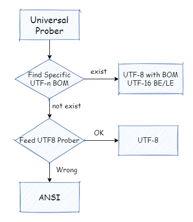

# chardet

[](https://go.dev)
[](https://github.com/ChenYuTong10/chardet/blob/master/LICENSE)

A character detector implemented by Go.

The detector aims to detecting *ANSI, UTF8, BOM UTF8* and *BOM UTF16 BE/LE* five encodings on **windows** platform.

## Example

```Golang
import (
    "log"
    "os"

    "github.com/ChenYuTong10/chardet"
)

func Foo() {
    f, err := os.Open("example.txt")
    if err != nil {
        log.Printf("open file error: %v", err)
        return
    }
    defer f.Close()

    buf := make([]byte, 1024)
    reader := bufio.NewReader(f)
    _, err = reader.Read(buf)
    if err != nil {
        log.Printf("read buf error: %v", err)
        return
    }

    d := new(Detector)
    d.Feed(buf)
    
    encoding := d.Encoding

    // do anything you want
}
```

## How it works

Let us first see the work flow of the detector.



There are five encodings we need to handle. But we can separate them with two groups.
One is **with BOM** and another one is **without BOM**.

**What is BOM**

BOM is a mark in front of a text specificly indicates the encoding.

The following table gives corresponding relations between the encoding and its byte prefix.

|  Encoding   | Byte Sequence Prefix  |
|  :----:  | :----:  |
| BOM UTF8  | `\xef\xbb\xbf` |
| BOM UTF16 BE | `\xfe\xff` |
| BOM UTF16 LE | `\xff\xfe` |

From the table, we can know that if we see a byte sequence with prefix `\xfe\xff`, we can know the encoding of the text is `BOM UTF16 BE`. 

Therefore, it is easy to distinguish the encodings of `BOM UTF8`, `BOM UTF16 BE` and `BOM UTF16 LE`.

**What's about without BOM**

The next thing is how we separate the *ANSI* and *UTF8* encoding without BOM. The solution is using **exclusive method**. 

A `UTF8` stream has its unique features compared with *ANSI*. If a encoding is against with this features, we can infer that the text is not encoded by `UTF8`.

**UTF8 Stream Features**

A UTF8 stream has following features:
- With the highest bit set to 0, it is a *single byte value*.
- With the highest two bit set to 10, it is a *continuation byte value*.
- If the byte sequence prefix is not either a single byte value or a continuation byte value, it will be a *multipart byte value*. **The first byte of a multipart byte value will indicate how many continuation byte value in total for this word.**

The key point is the last bold sentence.

For example:
- `\x65` is `0110 0101` written in binary. The highest bit is `0`, so it is *a single bit value.
- `\x88` is `1000 1000`. The highest two bit is `10`, so it is *a continuation byte value*.
- `\xef` is `1110 0110`. It is *a multipart byte value* and there are  two *continuation byte value* as following.

So with these features, we can distinguish the `UTF8` stream.

Finally, if some text is not `UTF8`, `BOM UTF8`, `BOM UTF16 BE/LE`, we think it is `ANSI`. The conclusion is only right on windows platform.

## References

01. [How chardet package in Python works](https://chardet.readthedocs.io/en/latest/how-it-works.html)
02. [A composite approach to language/encoding detection](https://www-archive.mozilla.org/projects/intl/universalcharsetdetection)
03. [What's with 0xC0 and 0x80](https://stackoverflow.com/questions/3911536/utf-8-unicode-whats-with-0xc0-and-0x80)
